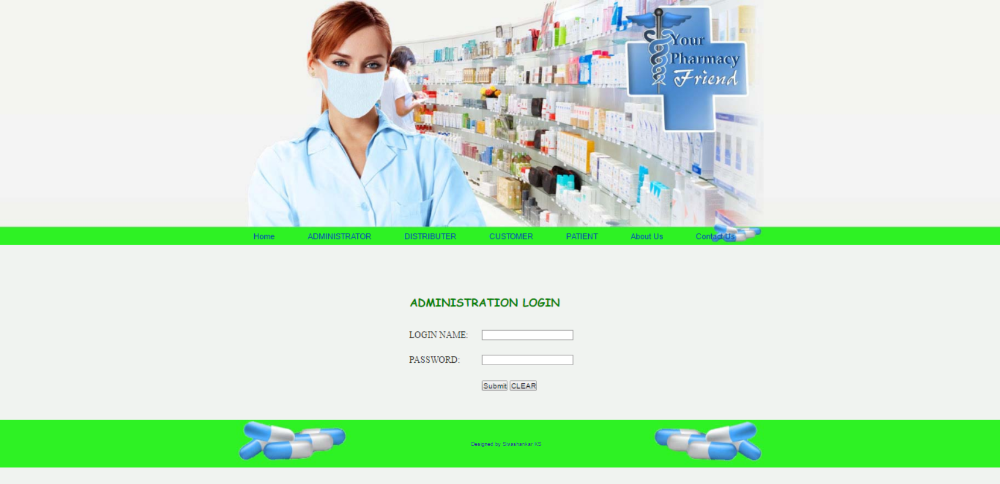
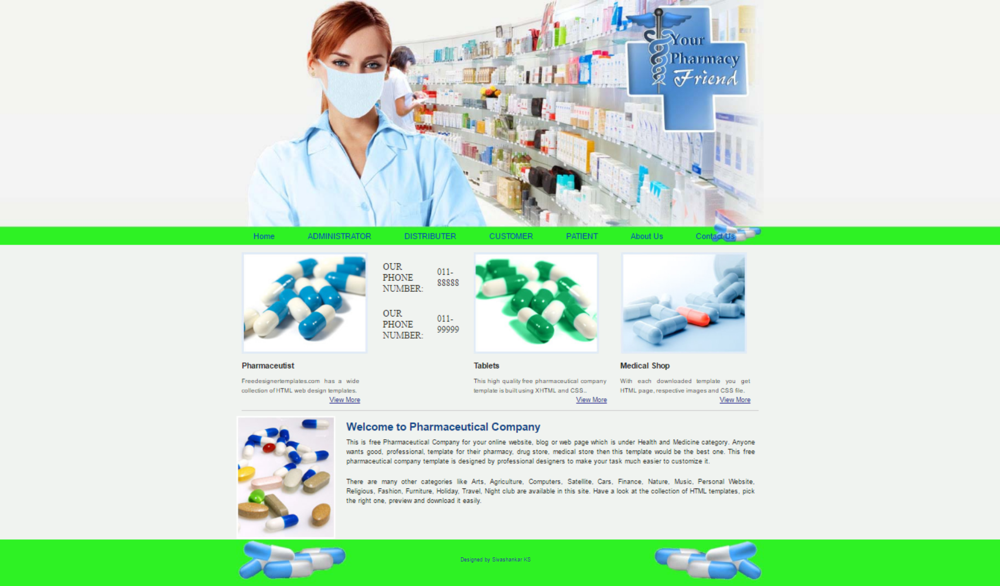

# Pharmacy-Project
This will helpfull to freshers
## Screenshots

Default template:

 
Home Page

 
Administrator login

 
admin page after successfull login

 
admin can access list of customers

 
admin can delete the customers

 
admin can update the customers

 
distributer login page

 
after successfull login of distributer

 
distributer can see list of orders

 
distributer can see his of order

 
customer login page

 
new customer registration page

 
customer page

 
patient login page

 
patient registration page

 
patient details

 
pharmacy about page

 
pharmacy contact-us page
